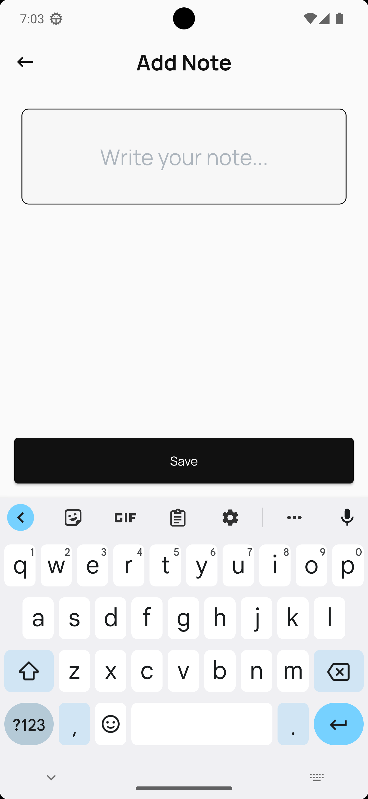

# Introduction

A simple note taking app that showcases feature-first Clean Architecture with BLoC.

# Development

This project is made using Flutter and it showcases the use of feature-first Clean Architecture with BLoC.

## Problem
> ### Flutter Assessment Coding Challenge:
> **"Simple Note-Taking App"**
>
> ### Requirements:
> - **Create a Note Model:** Use Freezed to define a Note model with fields like id, title, and content.
> - **API Service:** Implement a service class for network calls to handle fetching, adding, updating, and deleting notes from a mock API. You can use http package for this.
> - **Local Storage:** Use a package like shared_preferences or hive for local storage to cache the notes.
> - **State Management:** Use Flutter BLoC or Cubit to manage the state of the app. There should be states for loading, loaded, error, etc.
> - **UI:** Create screens for listing notes, viewing a single note, and editing or adding a note.
> - **Functionality:** The app should be able to display a list of notes, add a new note, update an existing note, and delete a note.
>
> Note: During the network call layer, you can just do a CRUD on the local storage mocking the network call.
>

## Packages Used
```
bloc
freezed
get_it
injectable
dio
retrofit
shared_preferences
internet_connection_checker
fpdart
intl
logger
go_router
flutter_svg
loading_indicator
awesome_snackbar_content
uuid
```

This project also uses [FVM - Flutter Version Management](https://fvm.app/) - a simple CLI to manage Flutter SDK versions.

# Screenshots

   
